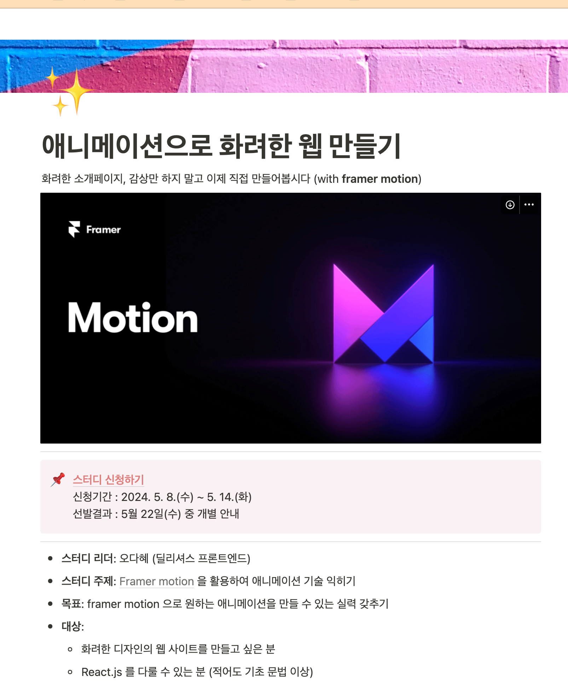
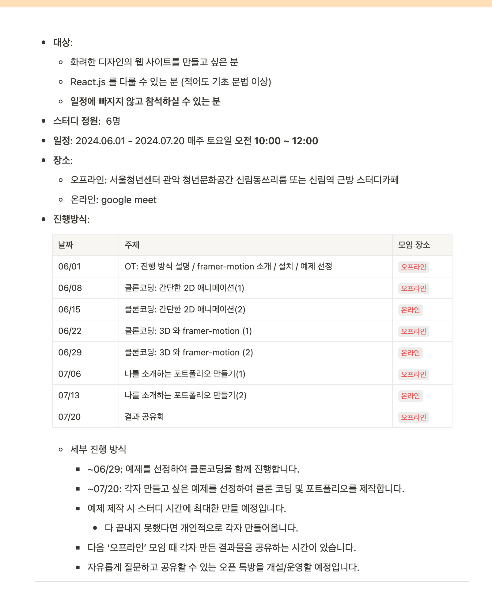

# 2024 framer-motion 스터디

> 서울 우먼잇츠 X 우아한스터디 [애니메이션으로 화려한 웹 만들기](https://puffy-stick-fa1.notion.site/425a2336698c4c81bf54bc308794034f?pvs=74)

## 📅 기간

- 2024.06.01 ~ 2024.07.20
- 매주 토요일 10:00 ~ 12:00

## 📌 목표

- framer-motion을 사용해 애니메이션을 구현 및 숙련도 향상
- 개인 포트폴리오 제작

## 📝 스터디 방법 / 진행방식

- 오프라인: 서울청년센터 관악 청년문화공간 신림동쓰리룸 또는 신림역 근방 스터디카페
- 온라인: google meet

| 날짜  | 주제                                       | 모임 장소 |
| ----- | ------------------------------------------ | --------- |
| 06/01 | OT / framer-motion 소개 / 설치 / 예제 선정 | 오프라인  |
| 06/08 | 클론코딩: 간단한 2D 애니메이션(1)          | 오프라인  |
| 06/15 | 클론코딩: 간단한 2D 애니메이션(2)          | 온라인    |
| 06/22 | 클론코딩: 3D 와 framer-motion (1)          | 오프라인  |
| 06/29 | 클론코딩: 3D 와 framer-motion (2)          | 온라인    |
| 07/06 | 나를 소개하는 포트폴리오 만들기(1)         | 오프라인  |
| 07/13 | 나를 소개하는 포트폴리오 만들기(2)         | 온라인    |
| 07/20 | 결과 공유회                                | 오프라인  |

## 📚 스터디 아카이빙

### 스터디 모집 공고

<table>
    <tr width="500px">
        
    </tr>
    <tr width="500px">
        
    </tr>
</table>

[스터디 모집 공고 링크](https://puffy-stick-fa1.notion.site/425a2336698c4c81bf54bc308794034f?pvs=74)

### 스터디 보고서

| 주차(날짜)   | 내용                                       | 정리 링크 | 참여자   |
| ------------ | ------------------------------------------ | --------- | -------- |
| 1주차(06/01) | framer-motion 소개, 스크롤 애니메이션 구현 | [링크]()  | @devohda |
| 2주차(06/08) |                                            | [링크]()  |          |
| 3주차(06/15) |                                            | [링크]()  |          |
| 4주차(06/22) |                                            | [링크]()  |          |
| 5주차(06/29) |                                            | [링크]()  |          |
| 6주차(07/06) |                                            | [링크]()  |          |
| 7주차(07/13) |                                            | [링크]()  |          |
| 8주차(07/20) |                                            | [링크]()  |          |

### 보고서 작성 방법

1. 스크립트 실행

```bash
$ npm run report

# or

$ yarn report
```

스크립트 실행 날짜 기준으로 `./reports` 디렉토리에 `yyyy-mm-dd.md` 파일이 생성됩니다.

2. 생성된 파일에 내용 작성
   날짜, 내용, 정리 링크, 참여자를 작성합니다.
