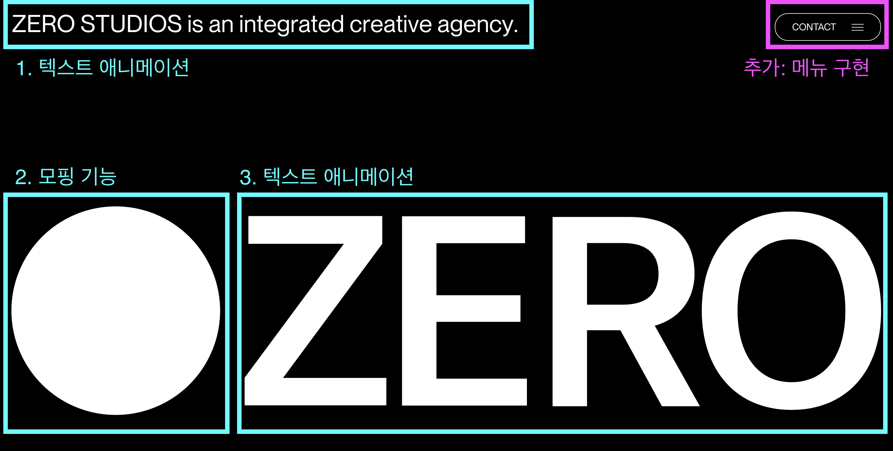

## 📅 날짜

2024.06.01 (토) 10:00 - 12:00

## 🙋 참석자

- [x] 오다혜
- [x] 강예정
- [x] 백승민
- [x] 변수경
- [x] 임하은
- [x] 박한솔

## 📝 스터디 요약

### 1. OT

- 자기소개
- 스터디 목표
- 스터디 방법 설명

### 2. 프로젝트 세팅

[https://stackblitz.com/edit/vitejs-vite-p9ng2g](https://stackblitz.com/edit/vitejs-vite-p9ng2g?file=README.md)

stackblitz 를 사용하여 미리 세팅해놓은 framer-motion 프로젝트 템플릿을 다운 받았습니다. 개인 컴퓨터의 node 버전이 맞지 않아서 오류가 발생하는 상황이 있었으나 업그레이드 후 문제를 해결했습니다.

현재 `node 20` 기준으로 프로젝트가 돌아갑니다.

다음에는 package.json 에 node 버전을 명시해서 오류가 발생하지 않도록 조치할 계획입니다.

### 3. framer motion 소개

공식 문서를 함께 보며 기능들을 훑어보았습니다.

<aside>
📖 [공식 문서 기능 정리]

- **Layout**
  - layout: 성능 이슈없이 CSS layout 를 변경하고 싶을 때 주는 옵션
  - initial: 초기 상태 정의
  - animate: 변화될 상태 정의
    - 속성으로 정적인 값 혹은 MotionValue 를 할당할 수 있음
- **Gestures**
  - whileHover / whileTap / whileFocus / whlieDrag / whileInView:
    각 이벤트가 발생했을 때의 상태 정의
- **Scroll**
  - [useScroll](https://www.framer.com/motion/use-scroll/): 스크롤 관련 데이터 반환
    - scrollX/Y
    - scrollXProgress/YProgress
  - whileInView: 컴포넌트가 뷰포트 내에 들어왔을 때 상태 정의
- **Transition** - 상태가 변할 때(애니메이션 동작 시) transition 효과 정의 - [type](https://codesandbox.io/p/sandbox/framer-motion-tween-vs-spring-vs-inertia-1ws2o?file=%2Fsrc%2Findex.js): `Tween`, `Spring`, `Inertia` - variants: 변수를 할당해서 부모의 상태 변화에 따라 자식의 상태를 변경시킬 수 있음
</aside>

### 4. 스크롤 애니메이션 예제 구현

약 1시간 30분 정도 예제를 클론 코딩했습니다. 각자 구현한 방법을 공유하며 학습한 애니메이션 속성들을 실제로 사용하는 시간을 가졌습니다.

```tsx
// 스크롤 시 구 이동시키는 기능 일부
const Ball = () => {
	const { scrollY } = useScroll(); // 스크롤 y 값
	const size = useTransform(scrollY, [0, 700], [200, 20]); // 스크롤 값 -> 구 크기로 변환

	return (
		<motion.div
			style={{
				width: size,
				height: size,
				backgroundColor: "white",
			}}
		/>
	);
};
```

## 📌 과제

https://www.zero.nyc/ 에서 스크롤 애니메이션을 클론 코딩해보기



## 📚 참고 자료

- [framer motion overview](https://www.framer.com/motion/animation/)
- [css 애니메이션 transform 성능](https://mong-blog.tistory.com/entry/CSS-%EC%99%9C-transform-%EC%95%A0%EB%8B%88%EB%A9%94%EC%9D%B4%EC%85%98-%EC%84%B1%EB%8A%A5%EC%9D%B4-%EC%A2%8B%EC%9D%84%EA%B9%8C-with-GPU-Reflow#google_vignette)
